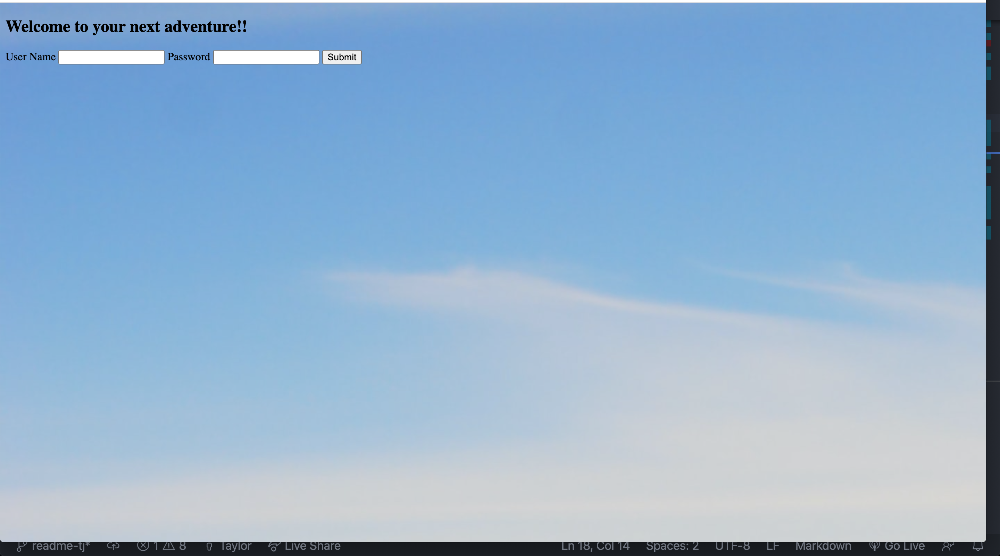

# Taylor Johnson Travel Tracker

## Author

Taylor Johnson [https://github.com/taylorjohnson141]

## Learning Goals
Travel Tracker was meant to help student understand API calls and OOP design as well as help students implement SASS and Test Driven Development. Some other learning goals for the project was to help students understand how to implemet a project board and practice gitwork flow and accsessability. 

## Setup

Clone Repo
run `npm install` for dependencies
to see project npm run script build then npm start
for testing run `npm test`  

## In Action 

In approaching the project I decided to appraoch classes and test driven development first and then stack SASS on it.

 ## UI
 The fitlit application looks as followed 
 
 Here is a demo of our application in action  
 

## Wins / Learning Experiences
Travel Tracker showed me that I need to plan out my UI and CSS more as well as implement Sass in a better way. I feel very strong in JavaScript but did not give myself enough time for Sass.
